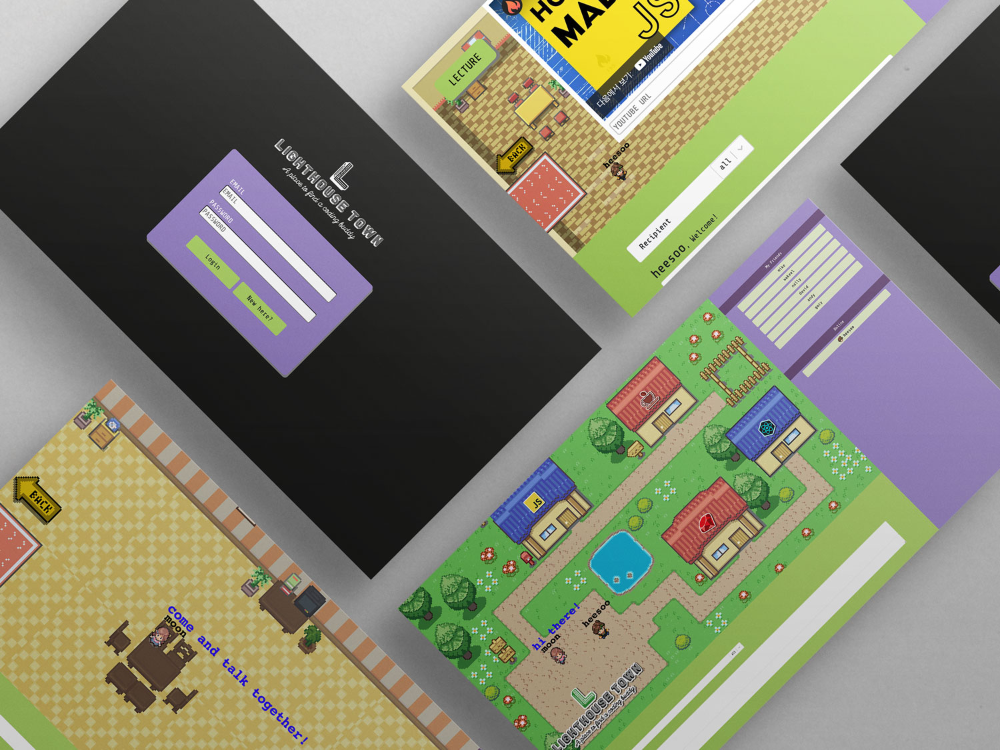
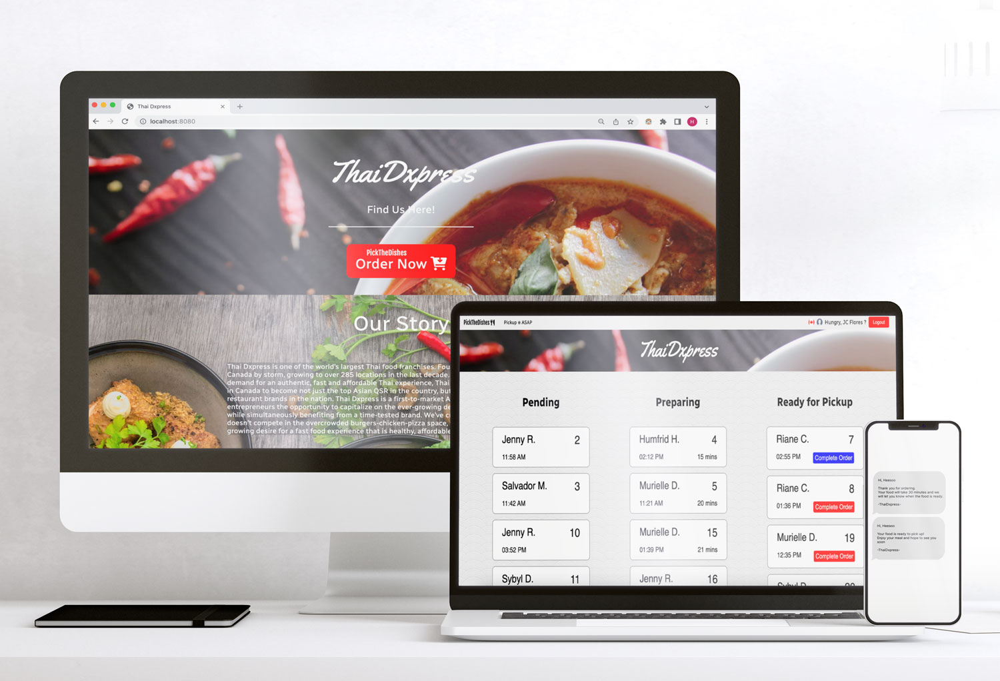
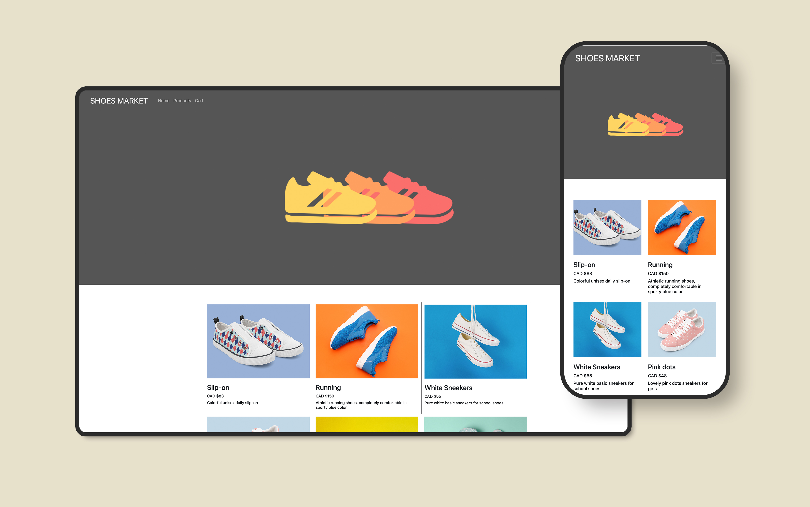

  User-centered developer with years of experience as a financial advisor and marketing specialist.  
  Passionate about learning and building things on the Internet that prioritize user experience. 
  Good communicator and team player who is able to empathize with people.

<h3 align="center"> 🧡 &nbsp&nbsp Tech Stack &nbsp&nbsp 🧡</h3>
 

  &nbsp
  &nbsp
  &nbsp
  &nbsp
  &nbsp
  &nbsp
   
  &nbsp
  &nbsp
  &nbsp
  &nbsp
  &nbsp
  &nbsp

 
<h3 align="center"> 💚 Projects 💚 </h3>

  <h2>Lighthouse Town : a gamification chat web app</h2>
   
  <a href="https://lighthouse-town.herokuapp.com" target="_blank">LIVE DEMO&nbsp&nbsp/</a>
  <a href="https://github.com/IamHPark/lighthouse-town" target="_blank">&nbsp&nbspGithub Repo</a>
  
You can test the app with id: test1@test.com pw: heesoo or register a new user!

  
Tech Stack: React.js | Node.js | HTML Canvas | Socket.I.O

   

  <h2>Pick The Dishes : restaurant ordering & management web app</h2>
   
  <a href="https://pickthedishes.herokuapp.com" target="_blank">LIVE DEMO&nbsp&nbsp/</a>
  <a href="https://github.com/IamHPark/pickthedishes" target="_blank">&nbsp&nbspGithub Repo</a>
    
Test as customer login id: 1 / as owner login id: 2

    
Tech Stack: Node.js | express | EJS | Twilio API | ajax 

   
  
  <h2>Shoes Market : e-commerce website </h2>
   
  <a href="https://iamhpark.github.io/shopping-mall/" target="_blank">LIVE DEMO&nbsp&nbsp/</a>
  <a href="https://github.com/IamHPark/shopping-mall" target="_blank">&nbsp&nbspGithub Repo</a>
    
Tech Stack: React.js | Redux

   
  
  <h2>Tiny App : a shorten url app </h2>
  <a href="https://github.com/IamHPark/tinyapp" target="_blank">
Github Repo
</a>
  
Tech Stack: Node.js | express | EJS | bycrpt 

 

🔭 I’m currently open to work  
🌱 I’m currently learning React & Redux 
📚 I'm currently reading "Modern Javascript Deep Dive"

<h3 align="center"> 💜 Reach Me Out 💜 </h3>

<!--
**IamHPark/IamHPark** is a ✨ _special_ ✨ repository because its `README.md` (this file) appears on your GitHub profile.

Here are some ideas to get you started:

- 🔭 I’m currently working on ...
- 🌱 I’m currently learning ...
- 👯 I’m looking to collaborate on ...
- 🤔 I’m looking for help with ...
- 💬 Ask me about ...
- 📫 How to reach me: ...
- 😄 Pronouns: ...
- ⚡ Fun fact: ...
-->
